# Table of Contents
1. [LJYZN-105](#ljyzn-105)
1. [YRM100](#yrm100)
1. [ES-F3105U / UCM601](#es-f3105u--ucm601)
1. [CF601](#cf601)
1. [WYUAN T50 UHF](#wyuan-t50-uhf-usb-c-keyboard-emulator)

## LJYZN-105
### Reader Image
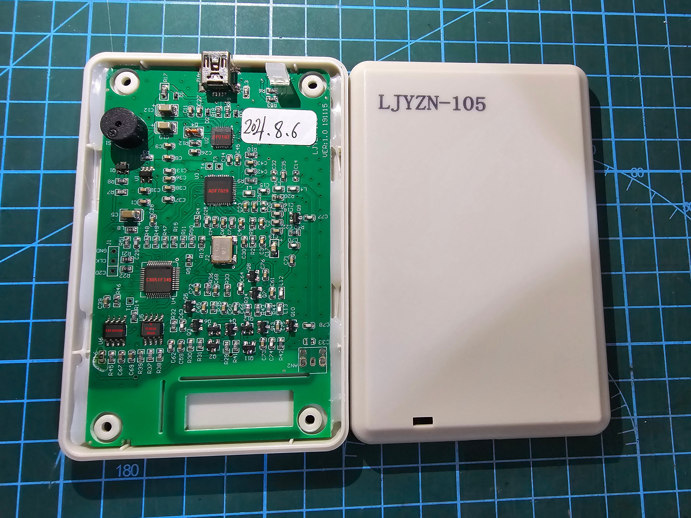 

### Software Image
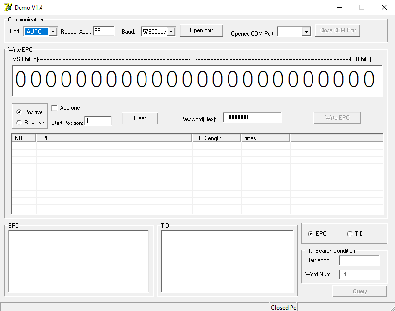

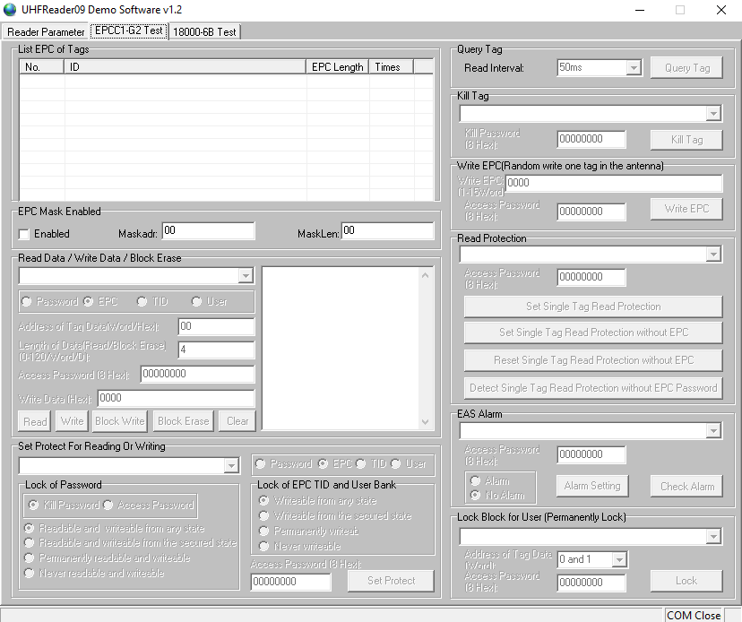 

### Website
- http://www.ljyzn.com/product_info.asp?id=146

### SDK
- http://www.ljyzn.com/product.asp?c_id=136
- [SDK](./SDKs/LJYZN-105/)

### Notes
- This reader is also commonly rebranded and sold under different names. It can be easily identified by the software used to communicate with it.
- Known limitations
  - Unable to write PC Flags UMI and Toggle

| Custom Tag Features | Supported |
| --- | :---: |
| MonzaQT | Yes |
| NXP Config | Yes |
| NXP EAS | Yes |
| NXP Read Protect | Yes |
| SM7 | No |
| Fudan GB Encryption | No |

## YRM100
### Reader Image

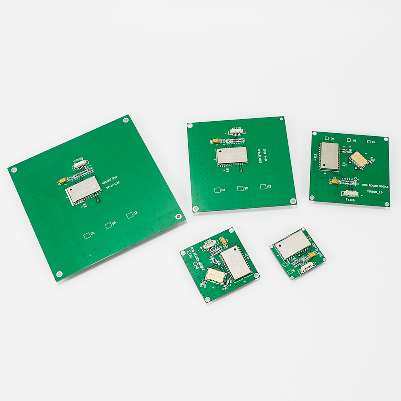 

### Software Image
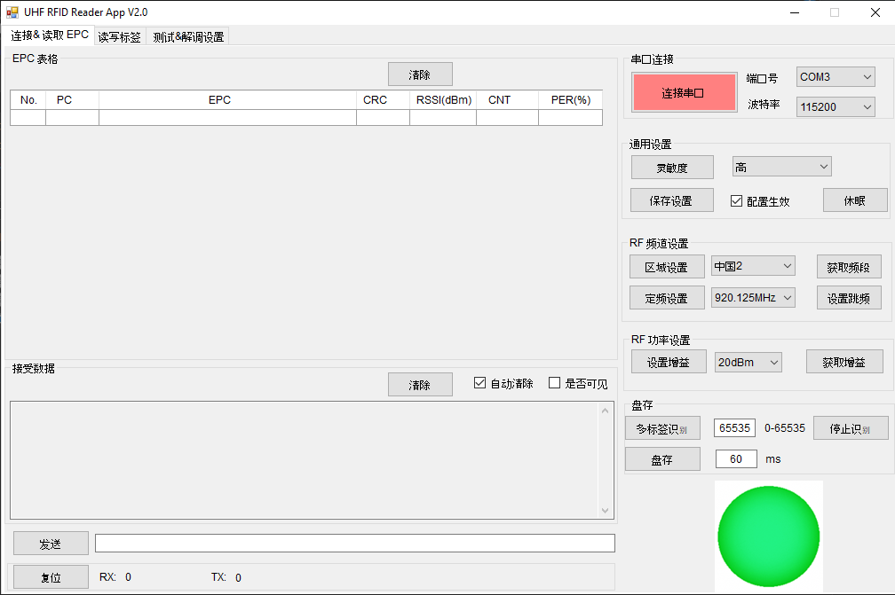

### Website
- http://www.invelion.net/product/html/?141.html

### SDK
- [SDK](./SDKs/YRM100/)

### Notes
| Custom Tag Features | Supported |
| --- | :---: |
| MonzaQT | Yes |
| NXP Config | Yes |
| NXP EAS | Yes |
| NXP Read Protect | Yes |
| SM7 | No |
| Fudan GB Encryption | No |

## ES-F3105U / UCM601
### Reader Image
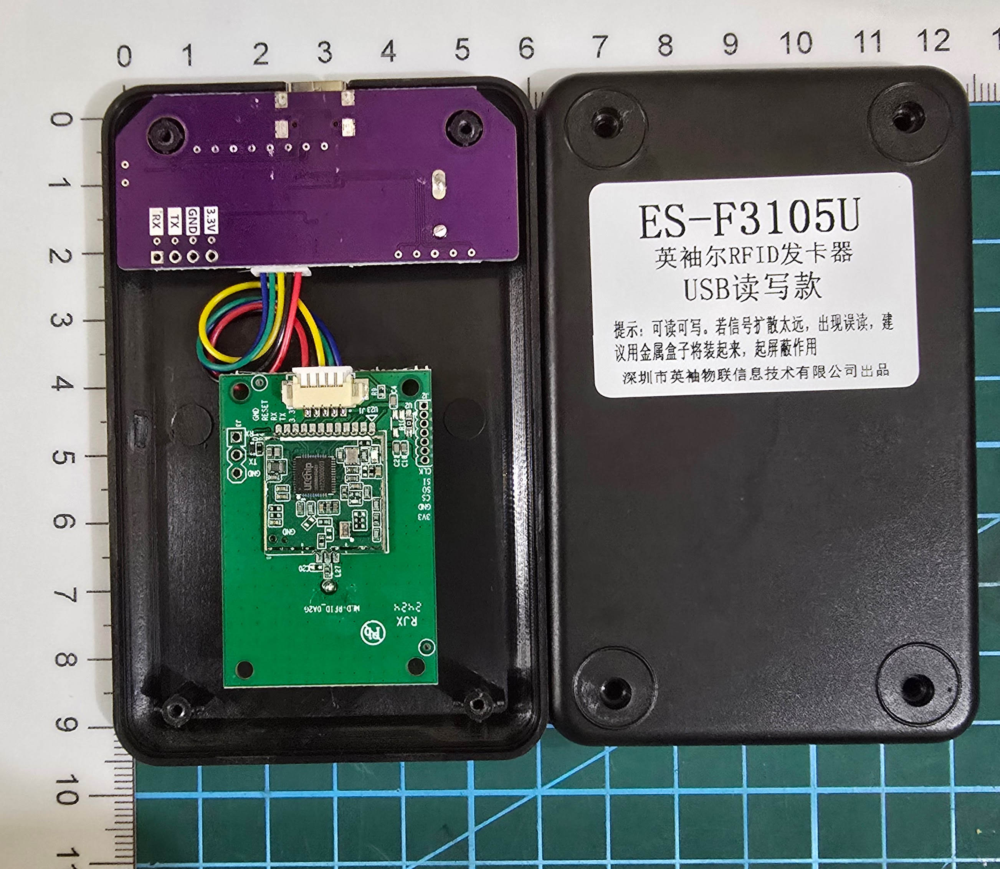

### Software Image
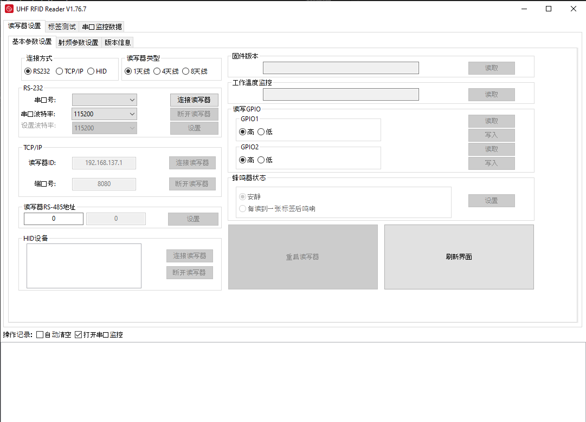
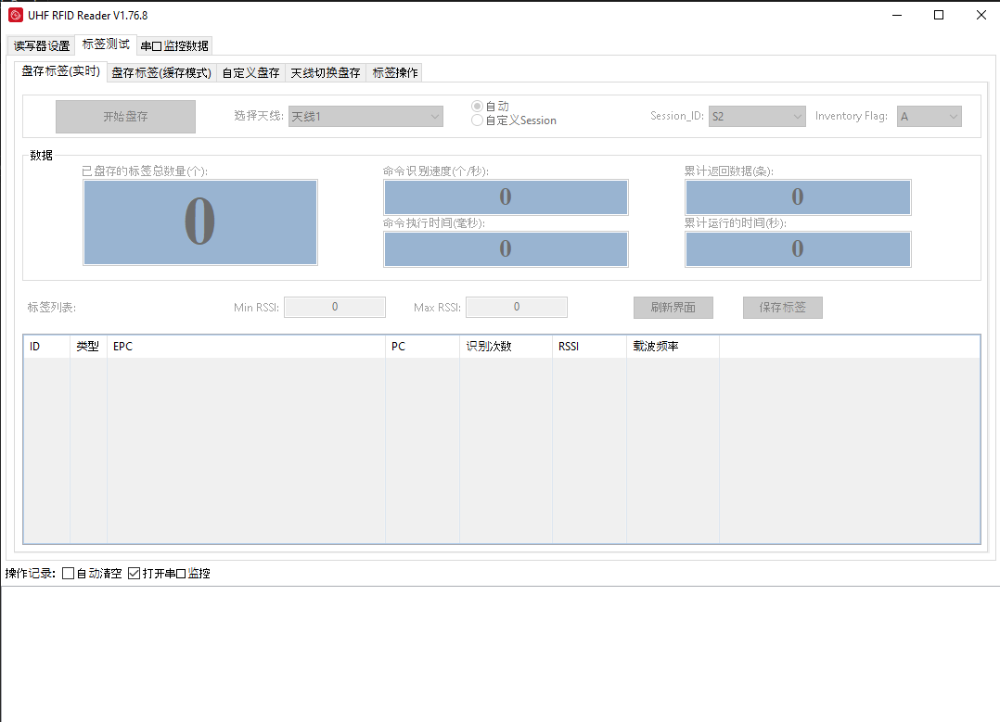
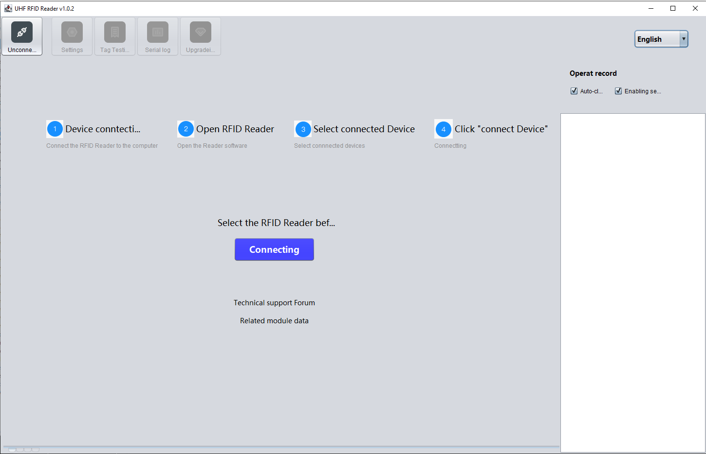 

### Website
- https://uc8088.com/t/topic/125

### SDK
- https://wiki.satinxenongery.com/s/cc3d2030-881d-4380-8424-ba18e3c0c451
- [SDK](./SDKs/ES-F3105U_UCM601/)

### Notes
- Known limitations
  - Limited support for custom tag features

| Custom Tag Features | Supported |
| --- | :---: |
| MonzaQT | No |
| NXP Config | No |
| NXP EAS | No |
| NXP Read Protect | No |
| SM7 | Yes |
| Fudan GB Encryption | Yes |

## CHAFON CF601
### Reader Image
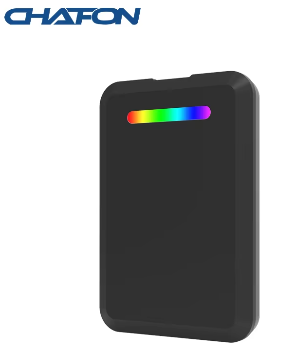

### Software Image
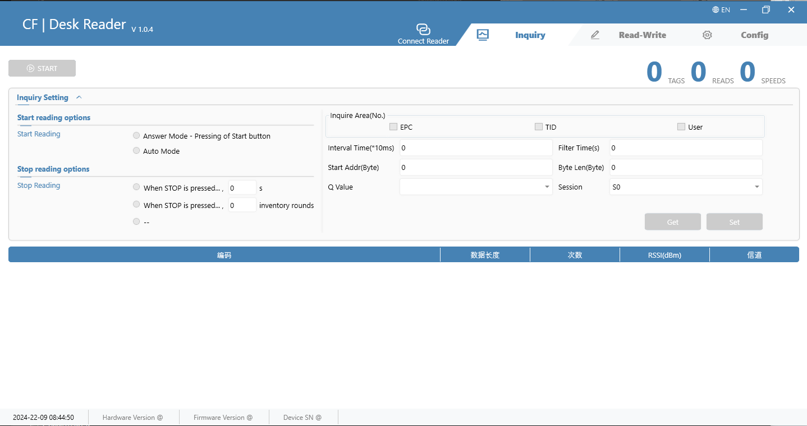 

### Website
- https://www.chafon.com/productinfo/1111082.html

### SDK
- https://www.chafontech.com/Download (passwd: chafonsdk)
- [SDK](./SDKs/CF601/)

### Notes
| Custom Tag Features | Supported |
| --- | :---: |
| MonzaQT | No |
| NXP Config | ??? |
| NXP EAS | Yes |
| NXP Read Protect | ??? |
| SM7 | No |
| Fudan GB Encryption | ??? |

## WYUAN T50 UHF (USB-C Keyboard Emulator)
### Reader Image
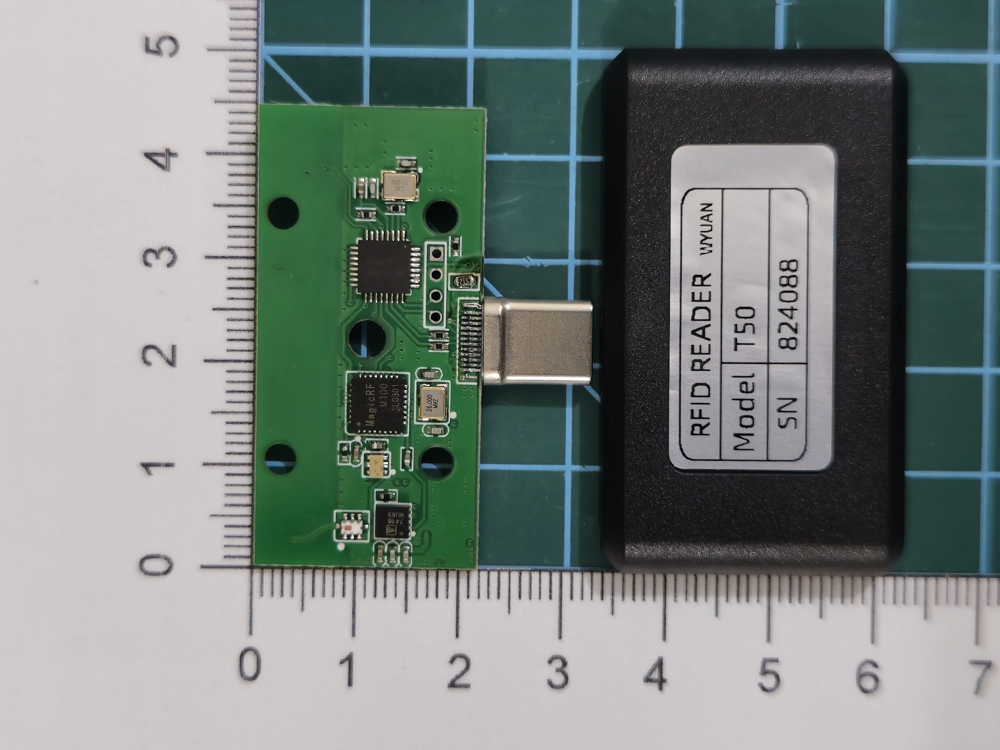
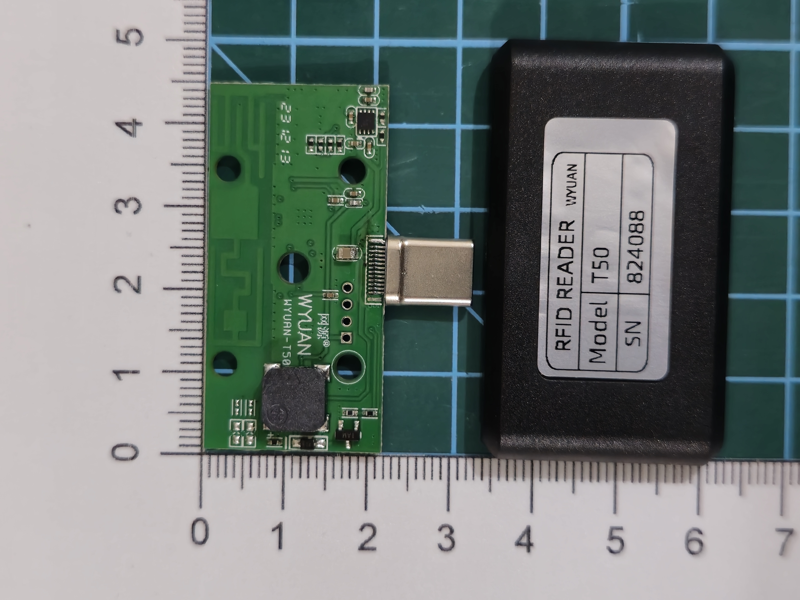 

### Notes
- Uses the MagicRF M100 chip