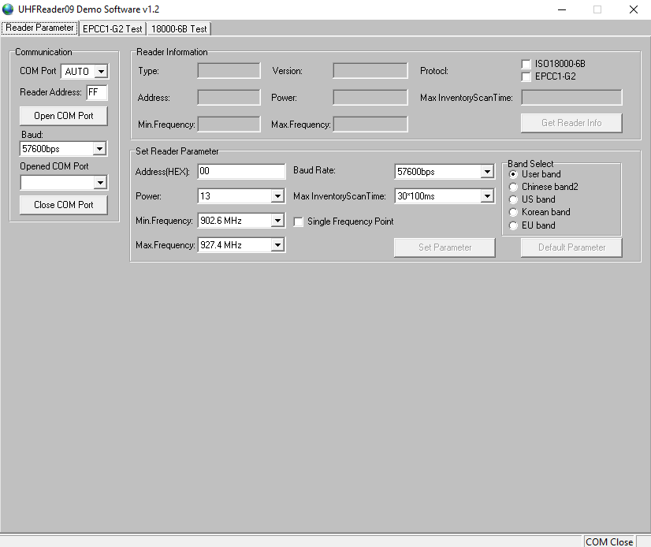
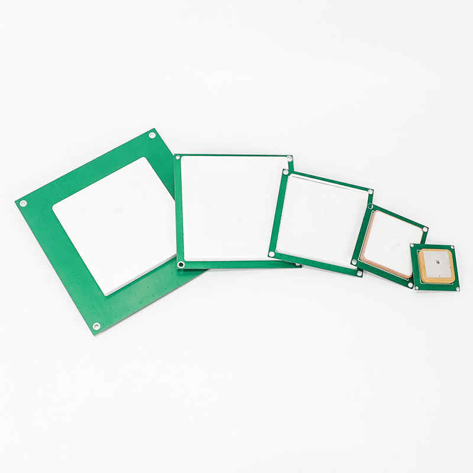
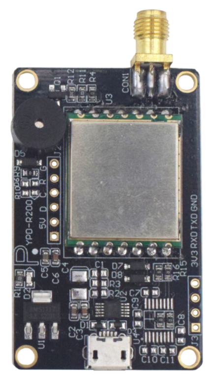
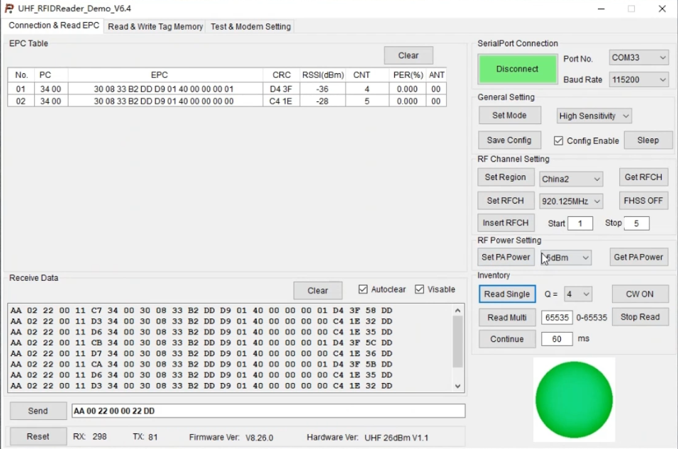
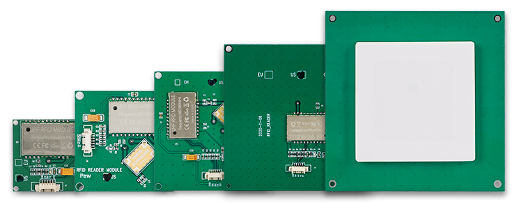
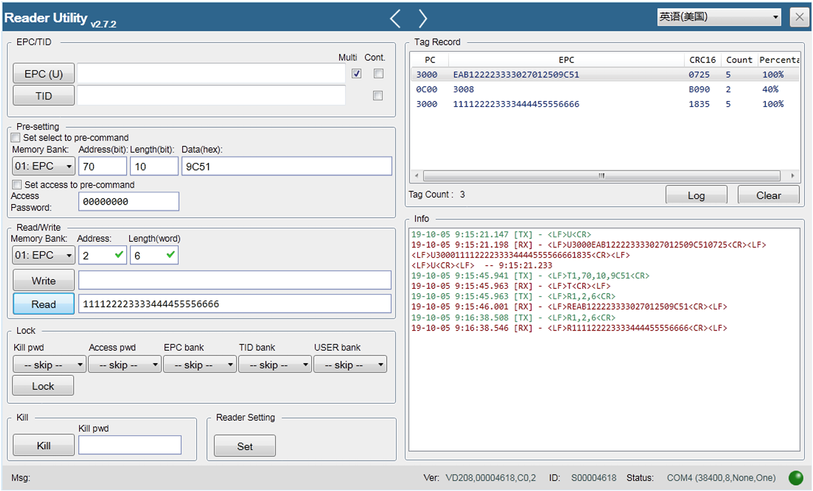

# Table of Contents
1. [LJYZN-105](#ljyzn-105)
1. [YRM100 / MagicRF (Q)M100](#yrm100--magicrf-qm100)
1. [ES-F3105U / UCM601](#es-f3105u--ucm601)
1. [YPD-R200](#ypd-r200)
1. [FM-5XX](#fm-5xx)
1. [CHAFON CF601](#chafon-cf601)
1. [WYUAN T50 UHF](#wyuan-t50-uhf-usb-c-keyboard-emulator)

# LJYZN-105
# Reader Image
 

## Software Image

 

## Website
- http://www.ljyzn.com/product_info.asp?id=146

## SDK
- http://www.ljyzn.com/product.asp?c_id=136
- [SDK](./SDKs/LJYZN-105/)

## Notes
- Serial protocol starts does not start with a fixed header
- This reader is also commonly rebranded and sold under different names. It can be easily identified by the software used to communicate with it.
- Supports reading ISO18000-6B cards
- Known limitations
  - Unable to write PC Flags UMI and Toggle

| Custom Tag Features | Supported |
| --- | :---: |
| MonzaQT | Yes |
| NXP Config | Yes |
| NXP EAS | Yes |
| NXP Read Protect | Yes |
| SM7 | No |
| Fudan GB Encryption | No |

# YRM100 / MagicRF (Q)M100
## Reader Image

 

## Software Image

## Website
- http://www.invelion.net/product/html/?141.html

## SDK
- [SDK](./SDKs/YRM100/)

## Notes
- Serial protocol starts with 0xBB

| Custom Tag Features | Supported |
| --- | :---: |
| MonzaQT | Yes |
| NXP Config | Yes |
| NXP EAS | Yes |
| NXP Read Protect | Yes |
| SM7 | No |
| Fudan GB Encryption | No |

# ES-F3105U / UCM601
## Reader Image

## Software Image

 

## Website
- https://uc8088.com/t/topic/125

## SDK
- https://wiki.satinxenongery.com/s/cc3d2030-881d-4380-8424-ba18e3c0c451
- [SDK](./SDKs/ES-F3105U_UCM601/)

## Notes
- Serial protocol starts with 0xA0
- Known limitations
  - Limited support for custom tag features

| Custom Tag Features | Supported |
| --- | :---: |
| MonzaQT | No |
| NXP Config | No |
| NXP EAS | No |
| NXP Read Protect | No |
| SM7 | Yes*1 |
| Fudan GB Encryption | Yes |

*1 - API is exposed in software but firmware (depending on reader) may not respond to the command. Implementation in documentation lists this as optional.

# YPD-R200
## Reader Image

## Software Image

## SDK
- [SDK](./SDKs/YPD-R200/)

## Notes
- Serial protocol starts with 0xAA

| Custom Tag Features | Supported |
| --- | :---: |
| MonzaQT | Yes |
| NXP Config | Yes |
| NXP EAS | Yes |
| NXP Read Protect | Yes |
| SM7 | No |
| Fudan GB Encryption | No |

# FM-5XX
## Reader Image

## Software Image

## Website
- http://www.fonkan.com/en_product_view_860.html

## SDK
- [SDK](./SDKs/FM-5XX/)

## Notes
- Protocol starts with \<LF\>\<Command\>\<CR\>

| Custom Tag Features | Supported |
| --- | :---: |
| MonzaQT | No |
| NXP Config | No |
| NXP EAS | No |
| NXP Read Protect | No |
| SM7 | No |
| Fudan GB Encryption | No |

# CHAFON CF601
## Reader Image

## Software Image
 

## Website
- https://www.chafon.com/productinfo/1111082.html

## SDK
- https://www.chafontech.com/Download (passwd: chafonsdk)
- [SDK](./SDKs/CF601/)

## Notes
- Serial protocol starts with 0xCF

| Custom Tag Features | Supported |
| --- | :---: |
| MonzaQT | No |
| NXP Config | ??? |
| NXP EAS | Yes |
| NXP Read Protect | ??? |
| SM7 | No |
| Fudan GB Encryption | ??? |

# WYUAN T50 UHF (USB-C Keyboard Emulator)
## Reader Image

 

## Notes
- Uses the MagicRF M100 chip