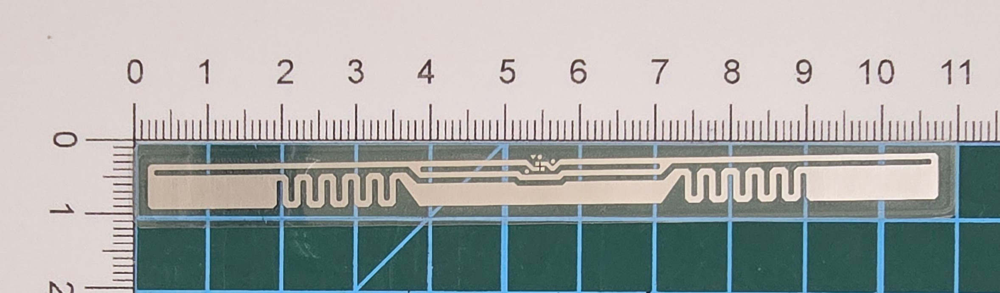

# Table of Contents
1. [Common Cards](#common-cards)
1. [TID Changeable Tags](#tid-changeable-tags)
1. [EM Microelectronic](#em-microelectronic)
1. [Alien Tags](#alien-tags)
1. [Impinj Tags](#impinj-tags)
1. [NPX Tags](#nxp-tags)
1. [Quanray Electronics Tags](#quanray-electronics)
1. [Shanghai Fudan Microelectronics Group](#shanghai-fudan-microelectronics-group)
1. [Kiloway](#kiloway)
1. [Other Special Tags](#other-special-tags)

## General Notes
- The shape of the tag does not determine what kind of tags they are
- The type of tags can be determined by the MDID/TMN stored in the tags TID

## Common Cards
 

## TID Changeable Tags
 
MDID / TMN : 008 / 848 
Notes :
- Access password from factory set to D4F3EAC9
- EPC/TID/USER Length is 8 words each
- Extremely picky at position/height placed when trying to write to tag
- Known Limitations
  - UMI flag in PC cannot be set

## EM Microelectronic
 
MDID / TMN : 00B / 044 (EM4325) 
Notes :
- [See Datasheet](https://www.emmicroelectronic.com/sites/default/files/products/datasheets/4325-ds_0.pdf)

## Alien Technology Tags
 
MDID / TMN : 003 / 813 (Higgs 10) 
Notes :

- TID : 14 Words
- EPC : 8 Words
- USER : 2 Words
---
 

 
MDID / TMN : 003 / 821 (Higgs 9) 
Notes :

- TID : 20 Words
- EPC : 8 Words
- USER : 43 Words
---
 

 
MDID / TMN : 003 / 412 (Higgs 3) 
Notes :

- TID : 12 Words
- EPC : 8 Words
- USER : 32 Words
---
 

 
MDID / TMN : 003 / 811 (Higgs EC) 
Notes :

- TID : 21 Words
- EPC : 10 Words
- USER : 8 Words

## Impinj Tags

 
MDID / TMN : 001 / 105 (Monza 4QT) 
Notes :

- TID : 12 Words
- EPC : 10 Words
- USER : 32 Words
---
 

 
MDID / TMN : 001 / 10C (Monza 4E) 
Notes :

- TID : 6 Words
- EPC : 33 Words
- USER : 8 Words
---
 

 
MDID / TMN : 001 / 190 (M750) 
Notes :

- TID : 9 Words
- EPC : 8 Words
- USER : 2 Words
---
 

 
MDID / TMN : 001 / 170 (Monza R6-P) 
Notes :

- TID : 6 Words
- EPC : 10 Words
- USER : 2 Words

## NXP Tags

 
MDID / TMN : 006 / 995 (UCODE 9) 
Notes :

- TID : 6 Words
- EPC : 8 Words
- USER : 0
- No Access Password
---
 

 
MDID / TMN : 006 / 894 (UCODE 8) 
Notes :

- TID : 6 Words
- EPC : 10 Words
- USER : 0
---
 

 
MDID / TMN : 006 / F12 (UCODE 7xm-2k) 
Notes :

- TID : 6 Words
- EPC : 30 Words
- USER : 128 Words
---
 

 
MDID / TMN : 006 / 915 
Notes :

- TID : 6 Words
- EPC : 8 Words
- USER : 0

## Quanray Electronics
 
MDID / TMN : 00F / 302 
Notes :

- TID : 6 Words
- EPC : 10 Words
- USER : 8 Words
---
 

 
MDID / TMN : 00F / 336 (Qstar-73 GB) 
Notes :

- TID : 6 Words
- EPC : 10 Words
- USER : 32 Words
---
 

 
MDID / TMN : 00F / 337 
Notes :

- TID : 6 Words
- EPC : 33 Words
- USER : 8 Words

## Shanghai Fudan Microelectronics Group 
 
MDID / TMN : 027 / 882 (FM13UF0051E) 
Notes :

- TID : 6 Words
- EPC : 10 Words
- USER : 2 Words

## Kiloway

 
MDID / TMN : 01D / 012 (KX2005X) 
Notes :

- TID : 12 Words
- EPC : 128 Words
- USER : 0 Words
- Tag has a unique property on tag where once a bit is flipped on, it cannot be turned off. The company calls this OTP Memory
- Tag has an LED that can be triggered by reading WORD 4 of RFU
- If you perform a single read on the EPC, it will return data up to 140 Words, single word reads will not go past 128 words
---
 

 
MDID / TMN : 01D / 016 (KX2005X-BL) 
Notes :

- TID : 12 Words
- EPC : 128 Words
- USER : 82 Words
- Tag has a unique property on tag where once a bit is flipped on, it cannot be turned off. The company calls this OTP Memory
- Tag has an LED that can be triggered by reading WORD 4 of RFU
- If you perform a single read on the EPC, it will return data up to 140 Words, single word reads will not go past 128 words

## Other Special Tags
 
MDID / TMN : N/A / N/A 
Notes :

- Only responds to inventory command
- EPC is read-only
